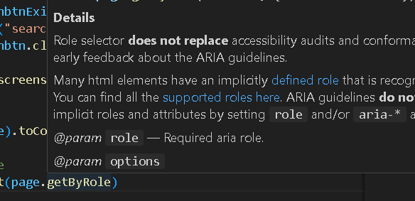

# Playwright
## Installation
Once the nodejs is installed, run the below command for playwright installation
```
npm init playwright@latest
```

The framework setup is done
- Typescript and browsers are installed by default

- If you want to update playwright:
    ```
    npm install playwright --save-dev
    ```
- to create a testmodule to write our tests
    ```
    npm install @playwright/test --save-dev
    ```
- to download typscript dependency
    ```
    npm install typescript --save-dev
    ```
- to initiaze typscript in our project and create tsconfig.json file
    ```
    npx tsc --init
    ```
    after initialising typescript. Goto ts.config file and change the target to "es6"
- We need a playwright test runner from Microscoft. As VSC is also from microsoft, its available in the extentions
    - goto settings in VSC -> extensions -> search for playwright -> Playwright Test for VSCode - install - Reopen VSCode if needed
    - just click on the run icon near the test inside the test created, this helps to track the run history
    - Right click on the play button in our test and select Reveal in TestExplorer to run your test. Its same as in testrunner OR click on the funnel shape in your left panel in VSCode

## Framework
- e2e tests are written under the /tests folder
- package.json is created during the installation
- playwright.config.ts - this file has all the information
    - testDir
    - fullyParallel
    - projects running in different browsers

## Playwright Commands - Good to know
If the fullyParallel is true the you can see test running in parallel in different browsers (as per specified)
- How to run a test (headless mode)
    ```
    npx playwright test
    ```
- How to run in a headed mode
    ```
    npx playwright test --headed
    ```
- How to run in a headed mode in a specific browser
    ```
    npx playwright test --headed --project=chromium
    ```
- to show the testreport
    ```
    npx playwright show-report
    ```
- Run the tests in UI mode with //a[text()='Docs'] in Locator tab in debugging mode
USing this command, the playwright testrunner opens 
        ```
        npx playwright test --ui
        ```
    - you have a Filter option on top to search for specific test, to select which browser you want to run your test and filter based on passed,failed and skipped
    - below is your test listed where you can run it and see how the test runs and also open the source next to the play button
    - in addition you have a 
        - Source tab - where the code itself is visible
        - Call tab - shows the functions that are called
        - Error tab - shows the error from the failed test
        - Console tab - prints the messages
        - Log tab - logs all the actions performed in the test
        - Networks tab
        - Attachment tab - generated the error-context file
        - Locator tab - which is used to find or highlight an element or work with xpaths to find the element eg: //a[text()='Docs']

## Locators
### Locate by test id
- In order to use a customed testattribute like data-test, you need to define it in playwright.config.ts under "use" like,

```
 use: {
    testIdAttribute: 'data-test',
  }
```
then we can use in test like this
```
page.getByTestId('search-submit')
```
- we can also use testattribute without defining like this:
  
```
page.locator('[data-test="search-submit"]')
```
Refer: https://playwright.dev/docs/locators#locate-by-test-id

### Locator - getByRole
Find Elements using ARIA Roles - Accessibility Role
The different types of roles are listed in getByRole, hover on it and click on the link "supported roles here" (see image). You will reach here to find what all role it supports
https://www.w3.org/TR/wai-aria-1.2/#role_definitions



Refer also: https://playwright.dev/docs/api/class-page#page-get-by-role